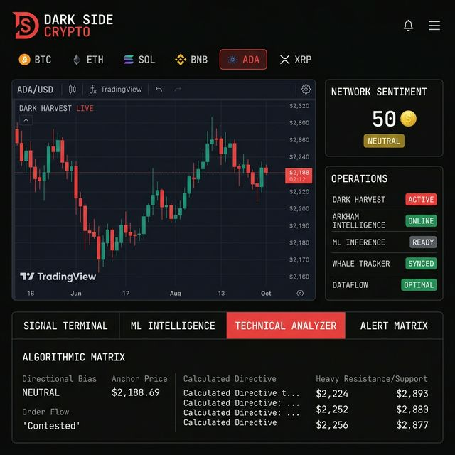

# 🤖 Crypto Intelligence Agent

> **Real-time crypto intelligence platform** — whale surveillance, ML price prediction, sentiment analysis, and multi-channel alerting. Enterprise-grade monitoring with live WebSocket feeds, advanced analytics, and intelligent risk detection.

**Version:** 1.0.0 (Production Ready)  
**Last Updated:** May 2026  
**Status:** ✅ All modules integrated and verified

---

## 🖥️ UI Screenshots

### 📊 Live Dashboard — Dark Side Crypto


> Real-time candlestick charts, network sentiment score, ML-powered algorithmic matrix, and whale operations — all in one dark-themed interface.

---

## 🎯 Core Features

### 📊 Real-Time Market Intelligence
- **Live Ticker Stream** — 24/7 price feeds from Coinbase, CoinGecko (WebSocket + REST)
- **OHLCV Candles** — 1h, 4h, 24h historical data with technical indicators
- **Price Spike Detection** — Configurable thresholds (default: 5-7% in 15-min windows)
- **Market Cap Tracking** — Real-time market cap and dominance metrics

### 🐋 Whale Transaction Monitoring
- **Large Transaction Detection** — Configurable thresholds for buy/sell/transfer alerts (default: $500k+)
- **Multi-Chain Support** — Ethereum, BSC, with Alchemy RPC integration
- **Wallet Watch Lists** — Add/remove addresses for continuous monitoring
- **Transaction Enrichment** — Source/destination labels, direction inference, USD value calculation
- **Arkham Intelligence Integration** — One-click explorer links for wallet forensics

### 🤖 ML-Powered Price Prediction
- **XGBoost Models** — Trained on technical indicators, volume, volatility patterns
- **Multi-Horizon Forecasting** — 1h, 4h, 24h predictions with confidence scores
- **Trend Classification** — Up/Down/Neutral with strength indicators
- **Feature Engineering** — RSI, MACD, Bollinger Bands, ATR, moving averages
- **Continuous Learning** — Model versioning and performance tracking

### 😨 Fear & Greed Index
- **Composite Scoring** — Derived from price volatility, momentum, social sentiment
- **Classification** — Extreme Fear/Fear/Neutral/Greed/Extreme Greed bands
- **30-Day History** — Trend analysis and classification changes
- **Component Breakdown** — Individual factor contributions

### 🚨 Intelligent Alert Engine
- **Multi-Channel Delivery** — Telegram, Email (SendGrid), SMS (Twilio), Webhooks
- **Alert Categorization** — Critical, High, Medium, Low severity levels
- **Smart Deduplication** — Prevents alert spam within time windows
- **Customizable Rules** — Price thresholds, whale activity, sentiment triggers, technical patterns
- **Real-Time Pub/Sub** — Redis-backed instant notifications

### 📈 Advanced Analytics Dashboard
- **Live Charts** — TradingView Lightweight Charts integration (candlestick, area, line)
- **Whale Activity Feed** — Chronological transaction stream with filtering
- **Alert Matrix** — Historical log with severity badges and Arkham links
- **Predictions Panel** — Current forecasts with confidence intervals
- **Fear & Greed Gauge** — Visual index with historical trends
- **System Configuration UI** — API key management with connection status

### ⚙️ System Management
- **User Settings Storage** — Encrypted API key management
- **Health Monitoring** — Liveness and readiness probes
- **Database Health Checks** — Connection validation and diagnostics
- **Graceful Shutdown** — Resource cleanup and connection pooling

---

## 💻 Technology Stack

### Backend API
| Component | Technology | Version |
|-----------|-----------|----------|
| Runtime | Node.js | 20.11.1+ |
| Language | TypeScript | 5.3.3 |
| Framework | Fastify | 4.26.2 |
| Database | SQLite / PostgreSQL | Latest |
| TimeSeries DB | TimescaleDB | 14.0+ |
| Cache/PubSub | Redis | 7.0+ |
| HTTP Client | Axios | 1.6.7 |
| Blockchain | ethers.js | 6.16.0 |
| Testing | Vitest | 1.3.1 |
| Coverage | @vitest/coverage-v8 | 1.3.1 |

### ML Service
| Component | Technology | Version |
|-----------|-----------|----------|
| Runtime | Python | 3.11+ |
| Framework | FastAPI | 0.104+ |
| ML Models | XGBoost | 2.0+ |
| Time Series | LSTM (PyTorch) | 2.0+ |
| Data Processing | pandas, numpy | Latest |
| Testing | pytest | 7.4+ |
| ASGI Server | uvicorn | 0.24+ |

### Frontend
| Component | Technology | Version |
|-----------|-----------|----------|
| Runtime | Node.js | 20.11.1+ |
| Language | TypeScript | 5.3.3 |
| Framework | React | 18.2.0 |
| Build Tool | Vite | 5.0.0+ |
| Charts | lightweight-charts | 5.1.0 |
| HTTP Client | Axios | 1.6.0 |
| Testing | @vitejs/plugin-react | 4.2.0 |

### DevOps & Infrastructure
| Component | Technology |
|-----------|-----------|----------|
| Containerization | Docker |
| Orchestration | Docker Compose |
| Load Testing | Artillery |
| Code Quality | Pylance (Python), TypeScript Compiler |

---

## 🏗️ Architecture

---

## Architecture

```
┌─────────────────────────────────────────────────────────┐
│  LAYER 1 — DATA SOURCES                                 │
│  Coinbase WS · CoinGecko REST · Alchemy RPC · Reddit   │
└────────────────────────┬────────────────────────────────┘
                         │ WebSocket / REST / RPC
┌────────────────────────▼────────────────────────────────┐
│  LAYER 2 — INGESTION (Node.js API)                      │
│  CoinbaseService · CoinGeckoService · WhaleTracker      │
│  PriceMonitor · Redis Pub/Sub queues                    │
└───────────┬────────────────────────┬────────────────────┘
            │ TimescaleDB            │ Redis Pub/Sub
┌───────────▼────────┐   ┌──────────▼────────────────────┐
│  LAYER 3 — ML      │   │  LAYER 4 — ALERT ENGINE       │
│  XGBoost + LSTM    │   │  AlertEngineService            │
│  FastAPI inference │   │  Telegram · Email · SMS        │
└────────────────────┘   └──────────┬────────────────────┘
                                    │
┌───────────────────────────────────▼────────────────────┐
│  LAYER 5 — FRONTEND (React 18 + Vite)                  │
│  Live charts · Whale feed · Fear & Greed · Alerts      │
└────────────────────────────────────────────────────────┘
```

---

## 🚀 Quick Start

### System Requirements
- **Node.js:** 20.11.1+ (LTS)
- **npm:** 10.0.0+ (ships with Node)
- **Python:** 3.11+ with pip
- **Docker:** 24.0+ (for database services)
- **Docker Compose:** 2.20+
- **RAM:** 4GB minimum (8GB+ recommended)
- **Disk:** 5GB available space

### 1. Environment Setup

```bash
cp .env.example .env
```

**Required environment variables:**
```env
# Database
DB_TYPE=sqlite              # or postgres
DB_PATH=./data/crypto_intelligence.sqlite

# Redis (optional if using SQLite only)
REDIS_URL=redis://localhost:6379

# External APIs
COINBASE_API_KEY=your_coinbase_key          # optional for public WS
COINGECKO_API_KEY=your_coingecko_key        # optional, free tier works
ALCHEMY_PROJECT_ID=your_alchemy_id          # required for whale tracking

# Alerts
TELEGRAM_BOT_TOKEN=your_telegram_bot_token
TELEGRAM_CHAT_ID=your_telegram_chat_id
SENDGRID_API_KEY=your_sendgrid_key         # for email alerts
TWILIO_ACCOUNT_SID=your_twilio_sid         # for SMS alerts
TWILIO_AUTH_TOKEN=your_twilio_token
TWILIO_PHONE_FROM=+1234567890
```

### 2. Install Dependencies

**Backend API:**
```bash
cd api
npm ci  # or npm install
```

**Frontend:**
```bash
cd frontend
npm ci  # or npm install
```

**ML Service:**
```bash
cd ml
python -m venv .venv
./.venv/Scripts/activate    # Windows
# or: source .venv/bin/activate  # Linux/macOS
pip install -r requirements.txt
```

### 3. Start All Services

**Option A: PowerShell (Windows — Recommended)**
```powershell
.\start_all.ps1          # Opens 3 new terminals for API, ML, Frontend
.\start_all.ps1 -Single  # Run sequentially in current terminal
```

**Option B: Manual (Cross-platform)**

Terminal 1 — Backend API:
```bash
cd api
npm run dev
# → http://localhost:3000
# → ws://localhost:3000/ws/tickers (WebSocket)
# → ws://localhost:3000/ws/whales (WebSocket)
```

Terminal 2 — ML Service:
```bash
cd ml
# Activate venv first (see step 2 above)
uvicorn src.inference.api:app --reload --port 8000
# → http://localhost:8000/docs (Swagger UI)
```

Terminal 3 — Frontend:
```bash
cd frontend
npm run dev
# → http://localhost:5173 (or next available port)
```

### 4. Verify All Services

```bash
# API Health
curl http://localhost:3000/health

# ML Service Health  
curl http://localhost:8000/health

# Frontend
Open browser: http://localhost:5173
```

---

## Running Tests

### Unit Tests — Node.js API (Vitest)

```bash
cd api
npm test              # run all tests once
npm run test:watch    # watch mode (auto-rerun)
npm run test:coverage # generate coverage report
```

**Coverage Targets:** 75% lines/functions, 65% branches

**Test Coverage:**

| Module | File | Coverage |
|--------|------|----------|
| Coinbase Integration | `coinbase.service.test.ts` | WS normalization, reconnection, heartbeat |
| Whale Tracking | `whale-tracker.service.test.ts` | Direction inference, thresholds, wallet CRUD |
| Cache Layer | `redis.helpers.test.ts` | O(1) set ops, key builders, sync |
| Price Data | `coingecko.service.test.ts` | Normalization, upsert, rate-limit polling |
| Alert Delivery | `alert-engine.service.test.ts` | Channel init, multi-channel delivery |
| Price Spikes | `price-monitor.test.ts` | Spike/crash detection, window logic |
| Sentiment | `fear-greed.test.ts` | Index calc, classification, components |
| Database | `db.client.test.ts` | Pool management, transactions, health

### Unit Tests — Python ML Service (pytest)

```bash
cd ml
pytest tests/ -v --cov=src
pytest tests/ -v --cov=src --cov-report=html  # HTML report
```

**Coverage Target:** 70%

**Test Coverage:**

| Module | File | Coverage |
|--------|------|----------|
| Technical Analysis | `test_technical_indicators.py` | RSI, MACD, Bollinger Bands, ATR, feature matrix |
| XGBoost Models | `test_xgboost_model.py` | Training, inference, serialization, edge cases |
| Performance | `test_performance.py` | Model accuracy, latency benchmarks |

---

## 📡 API Reference

### Health & Status
| Method | Endpoint | Description |
|--------|----------|-------------|
| GET | `/health` | Liveness probe (always 200) |
| GET | `/health/ready` | Readiness check (DB + Redis) |

### Market Data
| Method | Endpoint | Description |
|--------|----------|-------------|
| GET | `/api/tickers` | All latest tickers (cache-first) |
| GET | `/api/tickers/:symbol` | Single ticker details |
| GET | `/api/tickers/:symbol/candles?interval=1h&limit=100` | OHLCV history with limit |

### Whale Intelligence
| Method | Endpoint | Description |
|--------|----------|-------------|
| GET | `/api/whales/transactions?limit=50` | Whale transaction feed |
| GET | `/api/whales/wallets` | View watch list |
| POST | `/api/whales/wallets` | Add address: `{address, alias}` |
| DELETE | `/api/whales/wallets/:id` | Remove from watch list |
| GET | `/api/whales/stats` | 24h whale activity aggregates |

### Predictions
| Method | Endpoint | Description |
|--------|----------|-------------|
| GET | `/api/predictions/:symbol` | ML forecasts (1h, 4h, 24h) |
| POST | `/api/predictions/run` | Trigger fresh predictions |

### Sentiment & Fear Index
| Method | Endpoint | Description |
|--------|----------|-------------|
| GET | `/api/fear-greed/latest` | Current F&G index |
| GET | `/api/fear-greed/history?days=30` | Historical trend |

### Alerts
| Method | Endpoint | Description |
|--------|----------|-------------|
| GET | `/api/alerts?limit=50` | Alert history log |
| GET | `/api/alerts/:id` | Single alert details |

### Configuration
| Method | Endpoint | Description |
|--------|----------|-------------|
| GET | `/api/config` | Current config + API key status |
| POST | `/api/config` | Update API keys: `{keys: {...}}` |

### WebSocket Streams (Real-Time)
| Endpoint | Description |
|----------|-------------|
| `ws://localhost:3000/ws/tickers` | Live ticker price stream |
| `ws://localhost:3000/ws/whales` | Live whale transaction stream |
| GET | `/api/alerts/stats` | Alert delivery stats |
| POST | `/api/alerts/test` | Fire a test alert |
| WS | `/ws/tickers` | Real-time price stream |
| WS | `/ws/whales` | Real-time whale activity stream |

---

## Project Structure

```
crypto-intelligence/
├── shared/
│   └── types/index.ts          ← Single source of truth for all type contracts
│
├── api/                        ← Node.js + Fastify backend
│   ├── src/
│   │   ├── config.ts           ← Zod-validated env config (crashes fast on bad config)
│   │   ├── server.ts           ← Bootstrap — plugins, routes, services, graceful shutdown
│   │   ├── db/
│   │   │   ├── client.ts       ← PostgreSQL pool + transaction helpers
│   │   │   └── redis.ts        ← Redis clients + typed key builders + whale set helpers
│   │   ├── services/
│   │   │   ├── coinbase.service.ts      ← WS with exponential reconnect + heartbeat
│   │   │   ├── coingecko.service.ts     ← Rate-limited REST polling + multi-row upsert
│   │   │   ├── whale-tracker.service.ts ← Alchemy WS + O(1) Redis lookup + dedup
│   │   │   └── alert-engine.service.ts  ← Redis Pub/Sub → multi-channel fan-out
│   │   ├── routes/
│   │   │   ├── health.route.ts
│   │   │   ├── tickers.route.ts
│   │   │   ├── whales.route.ts
│   │   │   ├── alerts.route.ts
│   │   │   ├── fear-greed.route.ts
│   │   │   └── predictions.route.ts
│   │   ├── utils/
│   │   │   ├── price-monitor.ts  ← Rolling window spike/crash detector
│   │   │   ├── fear-greed.ts     ← Proprietary composite F&G computation
│   │   │   └── error-handler.ts  ← Typed AppError hierarchy
│   │   └── middleware/
│   │       └── error-handler.ts  ← Global Fastify error → ApiResponse normalizer
│   └── tests/unit/             ← 8 unit test files, ~120 test cases
│
├── ml/                         ← Python + FastAPI ML service
│   ├── src/
│   │   ├── features/
│   │   │   └── technical_indicators.py  ← Pure RSI/MACD/BB/ATR/EMA/OBV functions
│   │   ├── models/
│   │   │   └── xgboost_model.py         ← XGBoost + calibration + serialization
│   │   └── inference/
│   │       └── api.py                   ← FastAPI inference endpoints
│   ├── tests/
│   │   ├── test_technical_indicators.py ← 25 tests across 6 classes
│   │   └── test_xgboost_model.py        ← 24 tests across 5 classes
│   └── requirements.txt
│
└── infra/
    └── docker/
        ├── docker-compose.dev.yml
        └── init-scripts/
            └── 01_init_timescale.sql   ← Hypertables, indexes, seed data
```

---

## Development Roadmap

| Sprint | Status | Deliverable |
|---|---|---|
| 1 (Phase 0–1) | ✅ **Complete** | Config, schema, Coinbase WS, CoinGecko REST |
| 2 (Phase 2) | ✅ **Complete** | Whale tracker, Redis O(1) lookup, Telegram alerts |
| 3 (Phase 3 v1) | 🔨 Next | LSTM model training pipeline |
| 4 (Phase 4–5) | Planned | Full Fear & Greed + all alert channels |
| 5 (Phase 3 v2) | Planned | XGBoost ensemble + sentiment features |
| 6 (Phase 6) | Planned | React dashboard |
| 7 (Phase 7) | Planned | Production Docker + VPS + Grafana |
| 8 | Planned | Hardening, backtesting, rate limiting |

---

## Security Notes

- All config is validated at startup via Zod — app fails fast on bad env
- Secrets live in `.env` — never commit this file
- All DB queries use parameterized statements — no SQL injection surface
- Whale alert deduplication via Redis NX SET — prevents alert storms
- API rate-limited at 300 req/min via `@fastify/rate-limit`
- Read-only API scopes used wherever possible for exchange/RPC keys
